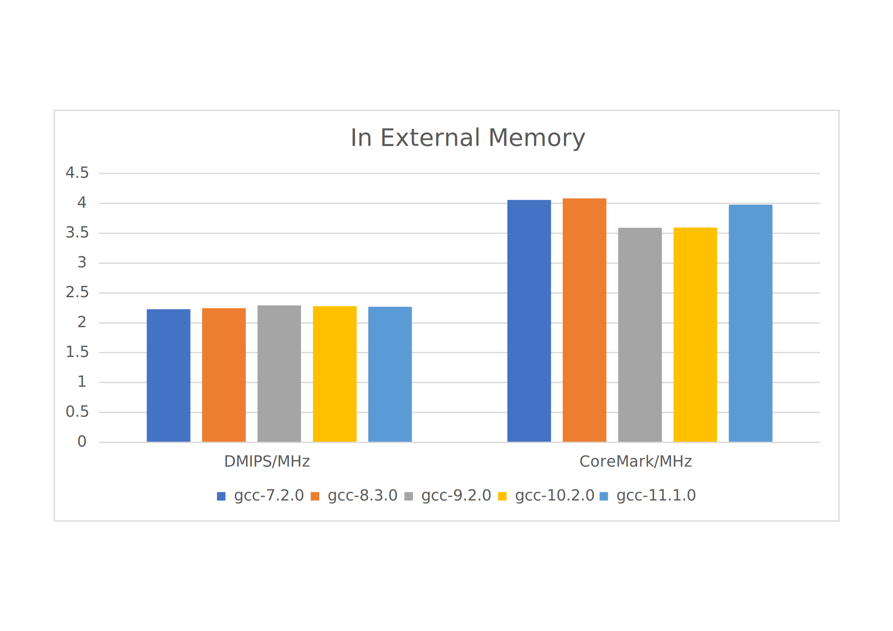
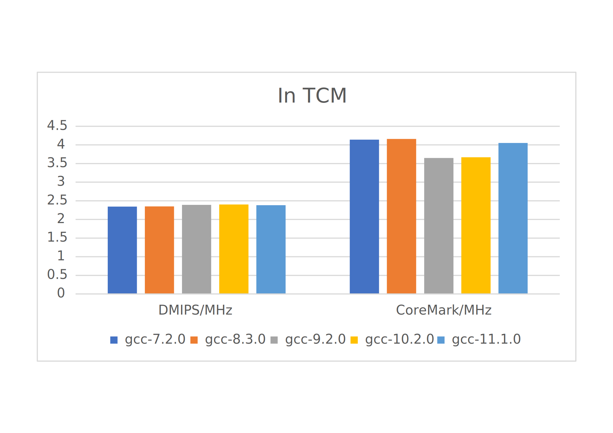

# biRISC-V - 32-bit dual issue RISC-V CPU Software Environment

biRISC-V is a 32-bit dual issue RISC-V CPU core, which can be obtained
from here,

github: http://github.com/ultraembedded/biriscv

This repo is for the software code running in the biRISC-V verilator
simulation enviroment. It includes coremark and dhrystone benchmarks.

Notes: The coremark and dhrystone reuquire a memory size of 256Kb. The
original biRISC-V TCM is only 64Kb. In order to run benchmarks in TCM,
I configured it to 256Kb.

# Geting Started

git clone --recursive https://github.com/kuopinghsu/biriscv.git

The SystemC and Verilator must be installed properly in system.

## Building toolchains

Install RISCV toolchains.

    # Ubuntu packages needed:
    sudo apt install autoconf automake autotools-dev curl libmpc-dev \
        libmpfr-dev libgmp-dev gawk build-essential bison flex texinfo \
        gperf libtool patchutils bc zlib1g-dev git libexpat1-dev
        
    git clone --recursive https://github.com/riscv/riscv-gnu-toolchain
    cd riscv-gnu-toolchain

    mkdir build; cd build
    ../configure --prefix=/opt/riscv --enable-multilib
    make -j$(nproc)

Install Verilator & SystemC

    # Ubuntu packages needed:
    sudo apt-get install verilator libsystemc-dev

    # install systemc if the libsystemc-dev package unavaliable
    wget https://www.accellera.org/images/downloads/standards/systemc/systemc-2.3.3.tar.gz
    tar xzf systemc-2.3.3.tar.gz
    cd systemc-2.3.3
    mkdir build && cd build
    ../configure --prefix=/usr/local
    make
    sudo make install

    # add the env into .bashrc
    export SYSTEMC_HOME=/usr/local/systemc-2.3.3
    export SYSTEMC_INCLUDE=$SYSTEMC_HOME/include
    export SYSTEMC_LIBDIR=$SYSTEMC_HOME/lib-linux64

    export LD_LIBRARY_PATH=$SYSTEMC_LIBDIR:$LD_LIBRARY_PATH

## Running Example

```
$ make hello
$ make coremark
$ make dhrystone
```

To run benchmarks in TCM, running the following commands.


```
$ make tcm=1 coremark
$ make tcm=1 dhrystone
```

### Coremark benchmark running with code and data in external memories

This is the results of running coremark in external memory using gcc-10.2.0.

```
        SystemC 2.3.3-Accellera --- May 18 2021 20:21:23
        Copyright (c) 1996-2018 by all Contributors,
        ALL RIGHTS RESERVED
Running: ../../../sw/coremark/coremark.elf
Memory: 0x80000000 - 0x8001d3d7 (Size=116KB) [.text]
Memory: 0x8001d3d8 - 0x8001d413 (Size=0KB) [.eh_frame]
Memory: 0x8001d418 - 0x8001f2fb (Size=7KB) [.data]
Memory: 0x8001f2fc - 0x8002334f (Size=16KB) [.bss]

Info: (I702) default timescale unit used for tracing: 1 ns (sysc_wave.vcd)
2K performance run parameters for coremark.
CoreMark Size    : 666
Total ticks      : 1112886
Total time (secs): 0.011129
Iterations/Sec   : 359.425853
Iterations       : 4
Compiler version : GCC10.2.0
Compiler flags   : -O2 -march=rv32im -mabi=ilp32 -nostartfiles -nostdlib -L../common -DPERFORMANCE_RUN=1 -fno-common -funroll-loops -finline-functions -falign-functions=16 -falign-jumps=4 -falign-loops=4 -finline-limit=1000 -fno-if-conversion2 -fselective-scheduling -fno-tree-dominator-opts -fno-reg-struct-return -fno-rename-registers --param case-values-threshold=8 -fno-crossjumping -freorder-blocks-and-partition -fno-tree-loop-if-convert -fno-tree-sink -fgcse-sm -fno-strict-overflow   -lc -lm -lgcc -lsys -T ../common/default.ld
Memory location  : STACK
seedcrc          : 0xe9f5
[0]crclist       : 0xe714
[0]crcmatrix     : 0x1fd7
[0]crcstate      : 0x8e3a
[0]crcfinal      : 0x9f95
Correct operation validated. See README.md for run and reporting rules.
CoreMark 1.0 : 359.425853 / GCC10.2.0 -O2 -march=rv32im -mabi=ilp32 -nostartfiles -nostdlib -L../common -DPERFORMANCE_RUN=1 -fno-common -funroll-loops -finline-functions -falign-functions=16 -falign-jumps=4 -falign-loops=4 -finline-limit=1000 -fno-if-conversion2 -fselective-scheduling -fno-tree-dominator-opts -fno-reg-struct-return -fno-rename-registers --param case-values-threshold=8 -fno-crossjumping -freorder-blocks-and-partition -fno-tree-loop-if-convert -fno-tree-sink -fgcse-sm -fno-strict-overflow   -lc -lm -lgcc -lsys -T ../common/default.ld / STACK
CoreMark/MHz: 3.594259
TB: Aborted at 14088860 ns
```

### Dhrystone benchmark running with code and data in external memories

This is the results of running dhrystone in external memory using gcc-10.2.0.

```
        SystemC 2.3.3-Accellera --- May 18 2021 20:21:23
        Copyright (c) 1996-2018 by all Contributors,
        ALL RIGHTS RESERVED
Running: ../../../sw/dhrystone/dhrystone.elf
Memory: 0x80000000 - 0x80015387 (Size=84KB) [.text]
Memory: 0x80015388 - 0x800153c3 (Size=0KB) [.eh_frame]
Memory: 0x800153c8 - 0x80017123 (Size=7KB) [.data]
Memory: 0x80017124 - 0x8001d967 (Size=26KB) [.bss]

Info: (I702) default timescale unit used for tracing: 1 ns (sysc_wave.vcd)

Dhrystone Benchmark, Version 2.1 (Language: C)

Program compiled without 'register' attribute

Please give the number of runs through the benchmark: 
Execution starts, 100 runs through Dhrystone
Execution ends

Final values of the variables used in the benchmark:

Int_Glob:            5
        should be:   5
Bool_Glob:           1
        should be:   1
Ch_1_Glob:           A
        should be:   A
Ch_2_Glob:           B
        should be:   B
Arr_1_Glob[8]:       7
        should be:   7
Arr_2_Glob[8][7]:    110
        should be:   Number_Of_Runs + 10
Ptr_Glob->
  Ptr_Comp:          -2147378832
        should be:   (implementation-dependent)
  Discr:             0
        should be:   0
  Enum_Comp:         2
        should be:   2
  Int_Comp:          17
        should be:   17
  Str_Comp:          DHRYSTONE PROGRAM, SOME STRING
        should be:   DHRYSTONE PROGRAM, SOME STRING
Next_Ptr_Glob->
  Ptr_Comp:          -2147378832
        should be:   (implementation-dependent), same as above
  Discr:             0
        should be:   0
  Enum_Comp:         1
        should be:   1
  Int_Comp:          18
        should be:   18
  Str_Comp:          DHRYSTONE PROGRAM, SOME STRING
        should be:   DHRYSTONE PROGRAM, SOME STRING
Int_1_Loc:           5
        should be:   5
Int_2_Loc:           13
        should be:   13
Int_3_Loc:           7
        should be:   7
Enum_Loc:            1
        should be:   1
Str_1_Loc:           DHRYSTONE PROGRAM, 1'ST STRING
        should be:   DHRYSTONE PROGRAM, 1'ST STRING
Str_2_Loc:           DHRYSTONE PROGRAM, 2'ND STRING
        should be:   DHRYSTONE PROGRAM, 2'ND STRING

Number_Of_Runs: 100
User_Time: 24960 cycles
Dhrystones_Per_Second_Per_MHz: 4006
DMIPS_Per_MHz: 2.280
TB: Aborted at 1655460 ns
```

### Benchmark scores

This is the summaries obtained using different compiler versions.

| In External Memory | gcc-7.2.0 | gcc-8.3.0 | gcc-9.2.0 | gcc-10.2.0 | gcc-11.1.0 |
|--------------------|-----------|-----------|-----------|------------|------------|
| DMIPS/MHz          | 2.228     | 2.244     | 2.292     | 2.280      | 2.269      |
| CoreMark/MHz       | 4.059887  | 4.08323   | 3.592209  | 3.594259   | 3.978821   |

<br>


| In TCM       | gcc-7.2.0 | gcc-8.3.0 | gcc-9.2.0 | gcc-10.2.0 | gcc-11.1.0 |
|--------------|-----------|-----------|-----------|------------|------------|
| DMIPS/MHz    | 2.346     | 2.349     | 2.389     | 2.400      | 2.383      |
| CoreMark/MHz | 4.142030  | 4.161448  | 3.649139  | 3.668722   | 4.052968   |

<br>

